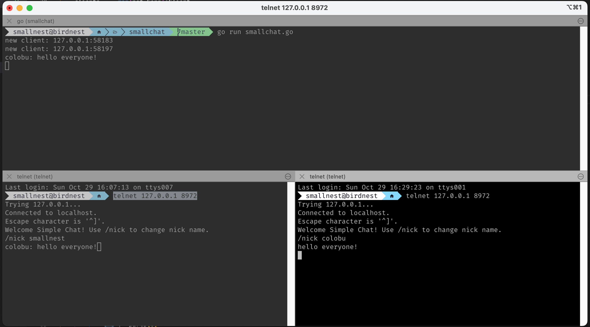
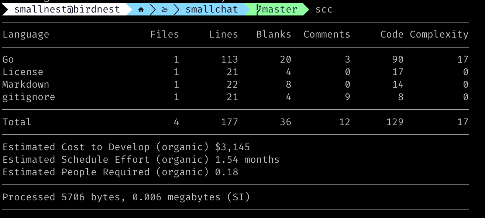

# smallchat
A minimal programming example for a chat server in Go.

Redis作者 Salvatore Sanfilippo 最近创建一个新的演示项目：[smallchat](https://github.com/antirez/smallchat)，用了200行代码实现了一个聊天室。这个项目的目的是展示如何用Go语言实现一个简单的聊天服务器。

他写这个项目的动机如下：

> 昨天我正在与几个前端开发者朋友闲聊,他们距离系统编程有些远。我们回忆起了过去的IRC时光。不可避免地,我说:编写一个非常简单的IRC服务器是每个人都应该做的一次经历。这样一个程序中有非常有趣的部分。一个进程进行多路复用,维护客户端状态,可以用不同的方式实现等等。
>
> 但然后讨论继续,我想,我会给你们展示一个极简的C语言例子。但是你能编写出什么是最小的聊天服务器呢?要真正做到极简,我们不应该需要任何合适的客户端。即使不是很完美,它应该可以用telnet或nc(netcat)工作。服务器的主要操作只是接收一些聊天信息并发送给所有其他客户端,这有时称为扇出操作。但是,这还需要一个合适的readline()函数,然后是缓冲等等。我们想要更简单的:利用内核缓冲区作弊,假装我们每次都从客户端收到一个完全形成的行(这个假设在实际中通常是正确的,所以事情有点工作)。
>
> 好吧,有了这些技巧,我们可以用只有200行代码实现一个聊天室,用户甚至可以设置昵称(当然,不计空格和注释)。由于我将这个小程序作为示例编写给我的朋友,我决定也把它推到Github上。

嗯，很有意思，这让我想起我最早在学校了玩BBS的时光，看到大家写的BBS服务端和客户端就觉得很神奇。最近几年我也一直在做网络编程方面的工作，所以我想使用Go语言实现antirez的这个小项目，看看Go语言在网络编程方面的表现如何。

最后以不到100行的代码实现了一个聊天室。

除去注释，不到一百行：
